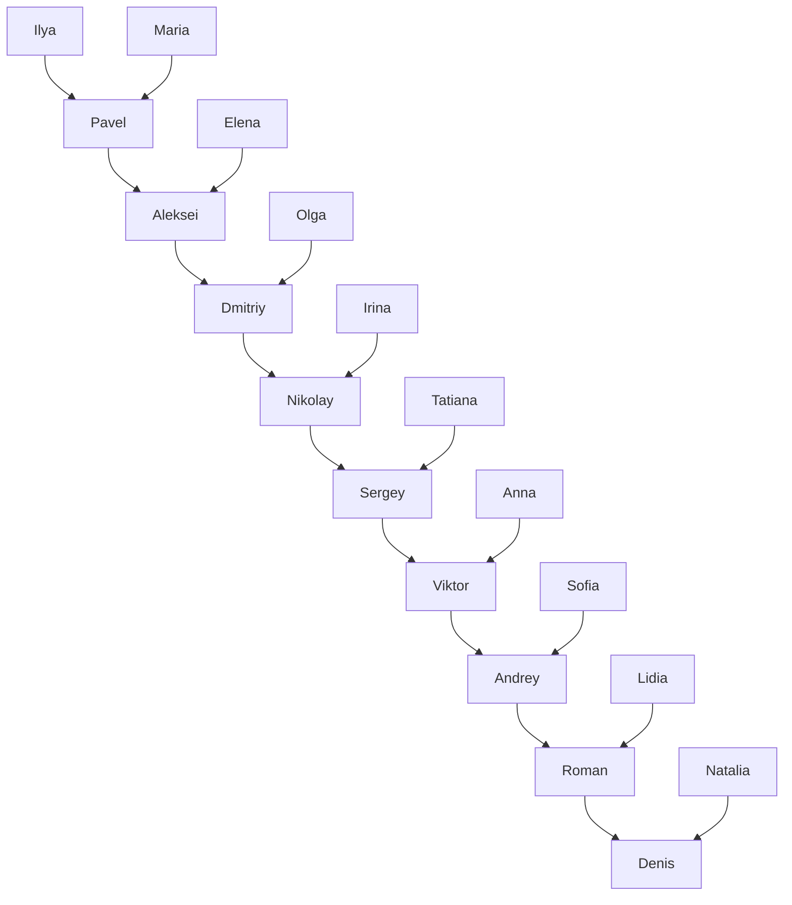
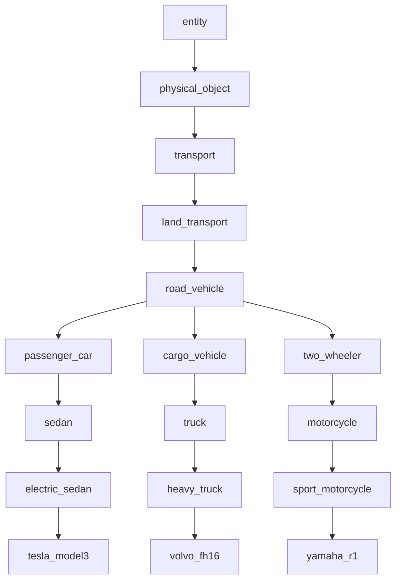

# Отчёт по лабораторной работе

## 1. Задание
Разработать:
1. Дерево семейных отношений на SWI-Prolog с глубиной не менее 8, с 8–10 правилами, включая рекурсивные.
2. Семантическую сеть (ширина 3–4, глубина 7–8) с не менее чем 8 правилами и выводом неявных фактов за счёт наследования.
3. Java-приложение (интерфейс и backend), вызывающее Prolog, с меню: **Файл**, **Правка**, **Вопросы**, **Справка**.

## 2. Семейное дерево (рисунок)

Глубина по линии `ilya -> ... -> denis` составляет 9 поколений (больше требуемых 8).

## 3. Семантическая сеть (рисунок)

Ширина на уровне `road_vehicle` равна 3 (`passenger_car`, `cargo_vehicle`, `two_wheeler`).
Глубина от `entity` до `tesla_model3` — 8 уровней.

## 4. Разработанные факты и правила

- Факты о поле (`male/1`, `female/1`) и родстве (`parent/2`).
- Факты семантической сети: `instance_of/2`, `is_a/2`, `property/2`.
- Правила семейного дерева:
  - `father/2`, `mother/2`, `child/2`, `son/2`, `daughter/2`,
  - `sibling/2`, `brother/2`, `sister/2`, `grandparent/2`,
  - рекурсивные `ancestor/2`, `descendant/2`.
- Правила семантической сети:
  - `member_of/2`, `subclass_of/2` (рекурсивно),
  - `class_property/2`, `has_property/2`,
  - `is_transport/1`, `suitable_for_long_trip/1`, `eco_friendly/1`.

## 5. Примеры результатов

### Семейные запросы
- `?- ancestor(ilya, roman).` → `true`.
- `?- descendant(denis, aleksei).` → `true`.
- `?- sibling(aleksei, karina).` → `true`.

### Запросы по семантической сети
- `?- has_property(tesla_model3, uses_roads).` → `true` (унаследовано от `road_vehicle`).
- `?- has_property(volvo_fh16, carries_cargo).` → `true` (через `heavy_truck -> truck -> cargo_vehicle`).
- `?- member_of(yamaha_r1, transport).` → `true` (через цепочку суперклассов).
- `?- eco_friendly(tesla_model3).` → `true` (через `uses_electricity`).

## 6. Вывод
В работе реализованы обе требуемые модели представления знаний на Prolog (родственные отношения и семантическая сеть), включая рекурсивный логический вывод и наследование свойств. Java-интерфейс обеспечивает редактирование базы знаний и выполнение типовых запросов через пункт меню «Вопросы», что демонстрирует интеграцию GUI и Prolog backend.
